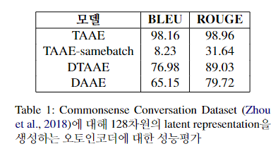
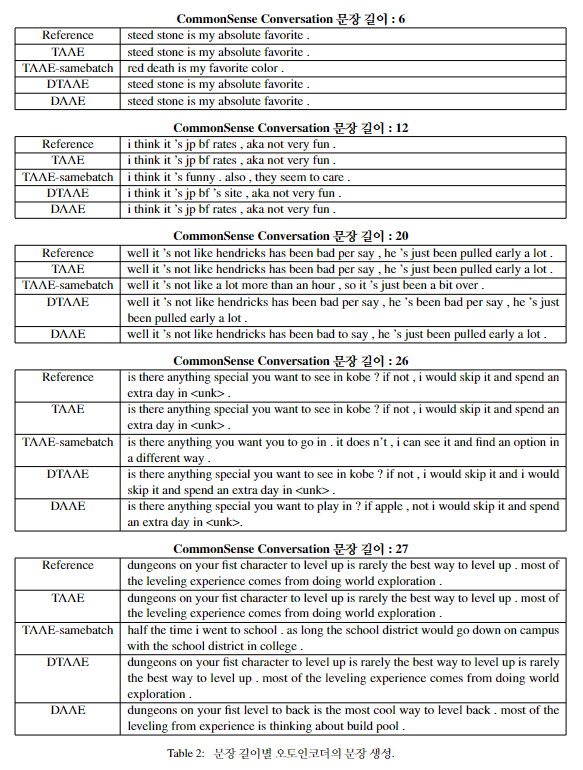

# Lower Dimensional Diffusion 
본 연구에서는 자연어 데이터에 특화된 방식으로 임베딩 차원을 효과적으로 줄이는 오토인코더 방법론인 TAAE(Transformer Adversarial Auto-Encoder)를 제안하며, 
이를 바탕으로 디퓨전기반 생성 모델을 활용한 자연어 생성 영역에서 state-of-the-art를 달성한 DiffuSeq 방법론과 비슷한 성능을 유지하면서도 
그 학습 및 추론 비용은 대폭 감소시킬 수 있는 모델 구조인LED(Low-dimension Embedding DiffuSeq)를 제안합니다.


# Transformer Adversarial AutoEncoder
해당 repository에서는 기존 LSTM 기반의 텍스트 오터인코더인 DAAE의 성능을 뛰어넘는 Transformer 기반의 오터인코더 Transformer Adversarial AutoEncoder (TAAE)를 제공하며,
설정에 따라 일반적인 Transformer Adversarial AutoEncoder (TAAE) 그리고 문장의 단어들에 노이즈를 추가하는 Denosing Transformer Adversarial AutoEncoder (DTAAE)까지 구축이 가능하며
성능은 아래와 같습니다.

<p align="center"></p>

모델이 학습되고 나면, 아래 그림과 같이 오토인코더 모델로 압축한 latent representation을 사용하여 다시 원본 문장과 유사하게 복원이 가능합니다.
<p align="center"></p>

기존 DAAE 논문과 코드는 아래와 같습니다.
[Educating Text Autoencoders: Latent Representation Guidance via Denoising](https://arxiv.org/abs/1905.12777)  
*Tianxiao Shen, Jonas Mueller, Regina Barzilay, and Tommi Jaakkola*
[Educating Text Autoencoders: Latent Representation Guidance via Denoising](https://github.com/shentianxiao/text-autoencoders)  
*Tianxiao Shen, Jonas Mueller, Regina Barzilay, and Tommi Jaakkola*


## 호환환경 
해당 코드는 파이썬 3.7 그리고 파이토치 1.13 버전에서 실행함

아래 모듈 다운로드, 데이터 다운로드, Training, Testing, Score 총 5개의 명령어는 다음과 같이 TAAE 폴더 내에서 실행
```
cd TAAE
```

## 모듈 다운로드
```
pip install requirements.txt
```

## 데이터 다운로드
CommonSense Comprehension 데이터 다운로드
```
bash download_cc.sh
```

## TAAE Training
학습 코드는 아래와 같이 실행
```
python train.py --train data/ccsplit/train.txt --valid data/ccsplit/valid.txt --model_type aae --lambda_adv 10  --save-dir checkpoints/TAAE
```
아래와 같이 번형을 주어 DTAAE 모델 학습 가능
- DAAE: `--model_type aae --lambda_adv 10 --noise 0.3,0,0,0 --save-dir checkpoints/DTAAE`, 이때 `--noise P,P,P,K` specifies word drop probability, word blank probability, word substitute probability, max word shuffle distance, respectively

## TAAE Testing
학습된 모델로 문장을 복원해내는 Task를 수행
```
python test.py --reconstruct --data data/ccsplit/test.txt --output sample --checkpoint checkpoints/model.pt
```
## TAAE Scoring
복원한 문장에 대한 BLEU와 ROUGE-L 산출
```
python score.py --reference checkpoints/sample/stest_inference.txt
```

현재 datasets 파일에는 예시 데이터셋만 존재. 따라서 DiffuSeq 학습에 사용할 데이터셋 다운로드(TAAE 데이터와 동일하지만 형식이 다름)
(CC Datasets Downloads)[https://drive.google.com/drive/folders/1exENF9Qc5UtXnHlNl9fvaxP3zyyH32qp?usp=sharing]

아래 명령어부터는 LED 파일에서 실행
## DiffuSeq Training
```
cd scripts
bash train.sh
```

## DiffuSeq Decoding
sample_seq2seq_tae 파일을 실행시키면 trained_diffuseq/ema_0.9999_014000.pt.samples.json 파일에 reconstruction 결과가 저장됨

## DiffuSeq Evaluation
```
cd scripts
python eval_seq2seq.py --folder ../trained_diffuseq/ema_0.9999_014000.pt.samples --mbr
```
BLEU, ROUGE Score 등 평가지표 확인 가능


만약 새롭게 학습시킨 TAAE 모델을 DiffuSeq 학습에 이용하고자 한다면 config.json 파일에서 tae_model_vocab_path 변수를 '../TAAE/checkpoints/TAAE'로 수정
